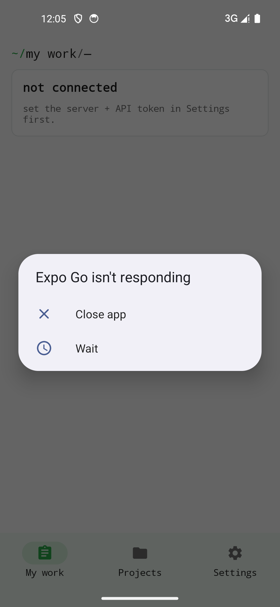

## Requirements

- A self-hosted, reachable OpenProject instance (HTTPS recommended).
- An API token for your user (see below).

## Create an API token in OpenProject

1. Sign in to OpenProject.
2. Avatar in the top right → **My Account** → **Access tokens**.
3. Click **+ API token**, give it a descriptive name (e.g. "Etabli Projet — Mobile") and copy the token.
4. The token is shown only once — store it somewhere safe before closing the dialog.

## Configure the app

1. Install the app from the store and open it.
2. In the setup dialog, enter:
   - **Server URL** (e.g. `https://op.example.org`)
   - **API Token** from the step above
3. On successful connection, the app loads project and work-package lists.

{width=320}

## Notes

- Permissions exactly mirror your OpenProject account. What you see in the web UI, you see in the app; what's missing there is also missing here.
- Credentials remain in the platform secure store.
- The app uses OpenProject's HAL+JSON API; rarely-used custom fields may not be fully rendered in the mobile detail view.
